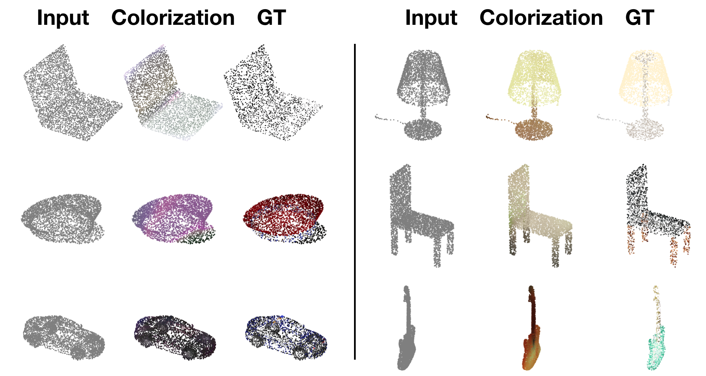

# Introduction
This is the implementation of paper ["point cloud colorization based on densely annotated 3d shape dataset"](https://arxiv.org/abs/1810.05396).

Sample Results:

# Data Preparation
Download prepared training data from [this link](https://drive.google.com/open?id=1_x_zdF7ZgBu1WQolWGFN3JTwDbWzXDFM) and decompress it into the `data` directory.

# Training
Just run:
`python train.py`  
Hyperparameters are saved in `base_config.ini` and could be tuned. Each time you train the model, a copy of the `ini` file is saved in `train_results/training time/`. The trained model parameters are saved in `train_results/training time/category_name/model/`; the intermediate colorization results of training data and test data are saved in `train_results/training time/category_name/logs/`.
